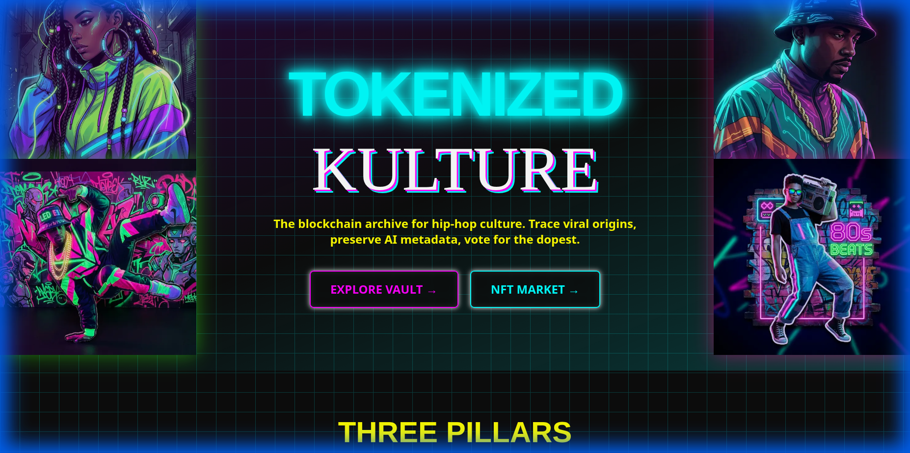
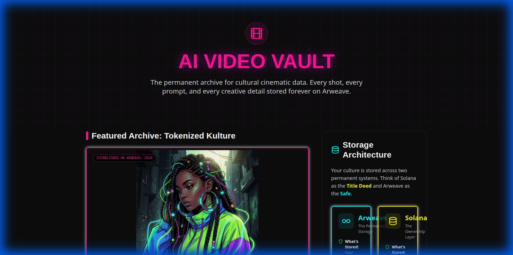
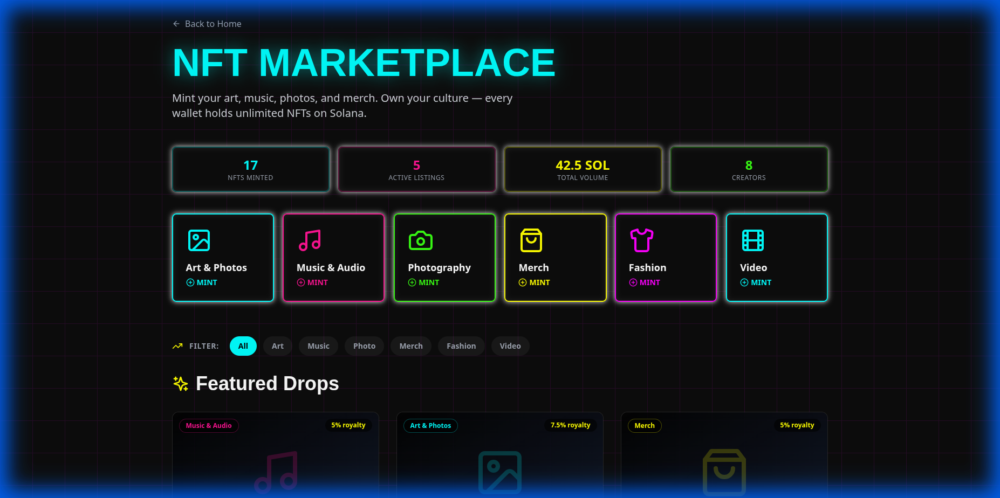
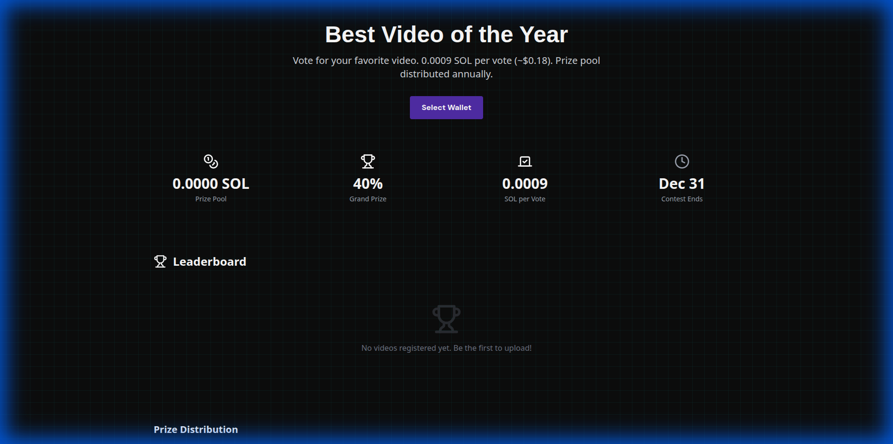

# 🌍 Tokenized Kulture

**Three Problems. One Platform. Permanently On-Chain.**

*Submission for the Solana AI Agent Hackathon 2026 — Colosseum*

**Visionary Creator:** Emmanuel EJ McDuffie Jr.

🌐 **[LIVE DEMO →](https://tokenized-kulture-monv.vercel.app)** | 📺 **[VIDEO →](https://youtu.be/eMXHZcExZYc)** | 💻 **[GITHUB →](https://github.com/ejmcduffie/TokenizedKulture)**

---

## 📽️ Project Showreel & Previews

### 📺 Official Demo Video
[](https://youtu.be/eMXHZcExZYc)
> *Watch the full vision on YouTube: [https://youtu.be/eMXHZcExZYc](https://youtu.be/eMXHZcExZYc)*

### 🖼️ Platform Previews
| Homepage | AI Video Vault |
| :---: | :---: |
|  |  |

| NFT Marketplace | Best Video Contest |
| :---: | :---: |
|  |  |

---


## 🎯 The Problems

1. **Cultural Amnesia** — Things trend on social media and nobody knows their real origins. The Arab Spring was born on Twitter, but today you can't reconstruct the original threads.

2. **AI Opacity** — Nobody can tell what is AI-generated and what is not. There's no standard for embedding *how* a video was made (camera angles, lighting, effects) into the content itself.

3. **Creator Value Extraction** — Creators fuel the cultural economy but have no skin in the game and no way to share in the value their culture generates.

---

## ✨ Three Pillars

### 🎬 Pillar 1: AI Video Vault (Permaweb YouTube)
A YouTube-format platform stored permanently on **Arweave** with rich cinematic metadata embedded in every upload. AI agents can query the metadata (camera motions, lighting, effects, AI provenance) to learn how videos are cinematically composed.

**Key Feature:** Every shot has machine-readable metadata — camera type, motion intensity, color grading, effects, and the exact generative AI prompt used. Richer metadata earns more **Kulture Points**.

### 📰 Pillar 2: Kulture Wire (The Grok Report)
A real-time cultural intelligence feed. When something goes viral, Kulture Wire traces it back to the **origin thread** on X/Twitter, pulls the original comments people were saying *when it was happening*, and archives the whole origin story permanently on Arweave.

**Key Feature:** Thread forensics via `conversation_id` tracing + permanent archival = cultural provenance that can never be erased.

### 🏆 Pillar 3: Best Video of the Year (Annual Solana Contest)
Users pay **0.0009 SOL per vote** (~$0.18) to vote for their favorite video. All vote fees accumulate into an annual prize pool. On December 31st, a smart contract distributes:

| Rank | Share |
|------|-------|
| 🥇 1st Place | 40% |
| 🥈 2nd–6th Place | 6% each (30% total) |
| 🎨 Creator Fund | 20% |
| 🏦 Platform Reserve | 10% |

Anti-spam: max 3 votes per wallet per video.

---

## 🚀 Quick Start

```bash
# Clone and install
git clone <repo-url>
cd TokenizeOurCulture
npm install

# Configure
cp .env.example .env
# Edit .env with your keys (optional — runs in demo mode without them)

# Run the agent
npm run dev

# Run tests (36 integration tests)
npx tsx tests/integration.test.ts
```

## 🏗️ Architecture

```
src/
├── index.ts                          # Entry point
├── core/
│   ├── agent.ts                      # Main decision engine (3-pillar orchestrator)
│   └── risk-manager.ts               # Position sizing & risk controls
├── collectors/
│   └── cultural-analyzer.ts          # Cultural token trend detection
├── strategies/
│   └── trading-engine.ts             # Multi-strategy signal generator
├── services/
│   ├── arweave-vault.ts              # Pillar 1: Permanent video metadata storage
│   ├── kulture-wire.ts               # Pillar 2: X/Twitter origin thread tracer
│   └── raffle-client.ts              # Pillar 3: Vote-based annual contest
├── types/
│   ├── index.ts                      # Core trading types
│   └── video-metadata.ts             # Metadata schemas for all 3 pillars
└── utils/
    └── logger.ts                     # Decision transparency logging

aiagenttube/                          # Production manifests & cinematic metadata
├── manifests/
│   ├── runway_gen3_manifest.md       # Shot-by-shot Gen-3 Alpha metadata
│   └── video_production_strategy_333.md
├── docs/
│   ├── JACKIE_BRIEFING.md            # Cinematic "Tech-Noir" style guide
│   └── JACKIE_ENGINEERING.md         # Node orchestration docs
└── logic/
    └── she_hulk_automator.ps1        # Batch branding automation

tests/
└── integration.test.ts               # 36 integration tests across all pillars
```

## 🔧 Technical Stack

| Component | Technology |
|-----------|-----------|
| Chain | Solana (via Solana Agent Kit v2) |
| Permanent Storage | Arweave (via Irys/Bundlr) |
| AI Analysis | OpenAI GPT-4 + heuristic cultural scoring |
| Social Data | X/Twitter API v2 |
| Video AI | Runway Gen-3 Alpha, Veo |
| Language | TypeScript (strict mode) |
| Logging | Winston (transparent decision tracking) |

## 📊 Test Results

```
📊 RESULTS: 36 passed, 0 failed, 36 total
✅ ALL TESTS PASSED
```

Verified:
- ✅ TypeScript compiles with zero errors
- ✅ AI Video Vault uploads metadata and computes Kulture Points
- ✅ Kulture Wire traces origins and archives on Arweave
- ✅ Vote Contest: registration, voting, anti-spam, prize distribution
- ✅ Cross-pillar pipeline: Upload → Register → Vote → Verify

---

*Built for the Solana AI Agent Hackathon 2026*
*Competing for the $100,000 USDC prize pool*
